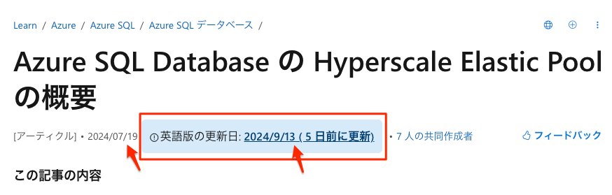

# learn\.microsoft\.com Update Checker

This Chrome extension displays the 'en-us' version update date of Microsoft Learn pages(`https://learn.microsoft.com/`). It compares the English version with the current language version and highlights the date if the current version is outdated.

<!-- @import "[TOC]" {cmd="toc" depthFrom=1 depthTo=6 orderedList=false} -->

<!-- code_chunk_output -->

- [learn\.microsoft\.com Update Checker](#learnmicrosoftcom-update-checker)
  - [Features](#features)
  - [Installation](#installation)
    - [Prerequisites](#prerequisites)
    - [Steps](#steps)
  - [Usage](#usage)
  - [Testing](#testing)
  - [Contribution](#contribution)
  - [License](#license)

<!-- /code_chunk_output -->

## Features

- If the current language page is more recent than the 'en-us' page


- Highlights the current language page's last update date if it is older than the 'en-us' page.



- Automatically fetches the latest update date from the corresponding English version (`en-us`) of the Microsoft Learn page.
- Displays the English version's update date directly below the any language version's update date.
- Simple and intuitive design; no manual activation required.

## Installation

### Prerequisites

- Google Chrome: Ensure you have the latest version of Google Chrome installed.
- Node.js and npm: Required for running tests and managing dependencies.

### Steps

1. Clone the Repository
2. Install Dependencies

Install the necessary packages for testing.

```bash
npm install
```

3. Load the Extension into Chrome

- Open Chrome and navigate to `chrome://extensions/`.
- Enable Developer mode by toggling the switch in the top right corner.
- Click on Load unpacked and select this directory.

4. Verify Installation

Navigate to any language Microsoft Learn page (e.g., https://learn.microsoft.com/ja-jp/azure/api-management/developer-portal-enable-usage-logs) and verify that the English update date is displayed below the update date.

## Usage

Once installed, the extension works automatically without any additional setup.

1. Visit any language Microsoft Learn Page

Navigate to a page such as https://learn.microsoft.com/ja-jp/some-page.

2. View the Update Dates

Below the existing update date, you will see the English version's update date with a link to the English page.

```
[アーティクル]・2024/08/24 英語版の更新日: 2024/08/24
```

Clicking on the English update date link will open the corresponding English page in a new tab.


## Testing

This extension includes both unit and end-to-end (E2E) tests.

- Run unit tests using Jest:

```bash
npm run test:unit
```

- Run E2E tests using Puppeteer:

```bash
npm run test:e2e
```

## Contribution

Contributions are welcome! Follow these steps to contribute:

- Fork the Repository

Click the "Fork" button at the top right of the repository page to create a copy of the repository under your GitHub account.

- Create a Feature Branch

```bash
git checkout -b feature/your-feature-name
```

- Commit Your Changes

```bash
git commit -m "Add some feature"
```

- Push to the Branch

```bash
git push origin feature/your-feature-name
```

- Open a Pull Request

Navigate to the original repository on GitHub and click "Compare & pull request". Provide a clear description of your changes and submit the pull request.

## License
[MIT License](LICENSE)
