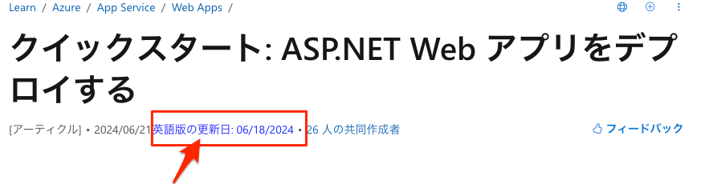

# JP Learn Microsoft\.com Update Checker

This Chrome extension is specifically designed to check and display the latest update date from the English version of the Microsoft Learn page when you're viewing the Japanese version (`https://learn.microsoft.com/ja-jp`).

<!-- @import "[TOC]" {cmd="toc" depthFrom=1 depthTo=6 orderedList=false} -->

<!-- code_chunk_output -->

- [JP Learn Microsoft\.com Update Checker](#jp-learn-microsoftcom-update-checker)
  - [Features](#features)
  - [Installation](#installation)
    - [Prerequisites](#prerequisites)
    - [Steps](#steps)
  - [Usage](#usage)
  - [Testing](#testing)
  - [Contribution](#contribution)
  - [License](#license)

<!-- /code_chunk_output -->

## Features



- Automatically fetches the latest update date from the corresponding English version (`en-us`) of the Microsoft Learn page.
- Displays the English version's update date directly below the Japanese version's update date.
- Simple and intuitive design; no manual activation required.

## Installation

### Prerequisites

- Google Chrome: Ensure you have the latest version of Google Chrome installed.
- Node.js and npm: Required for running tests and managing dependencies.

### Steps

1. Clone the Repository

```bash
git clone https://github.com/koudaiii/update-checker-extension.git
cd update-checker-extension
```

2. Install Dependencies

Install the necessary packages for testing.

```bash
npm install
```

3. Load the Extension into Chrome

- Open Chrome and navigate to chrome://extensions/.
- Enable Developer mode by toggling the switch in the top right corner.
- Click on Load unpacked and select the update-checker-extension directory.

4. Verify Installation

Navigate to any Japanese Microsoft Learn page (e.g., https://learn.microsoft.com/ja-jp/some-page) and verify that the English update date is displayed below the Japanese update date.

## Usage

Once installed, the extension works automatically without any additional setup.

1. Visit a Japanese Microsoft Learn Page

Navigate to a page such as https://learn.microsoft.com/ja-jp/some-page.

2. View the Update Dates

Below the existing update date, you will see the English version's update date with a link to the English page.

```
[アーティクル]・2024/08/24 英語版の更新日: 08/24/2024
```

Clicking on the English update date link will open the corresponding English page in a new tab.


## Testing

This extension includes both unit and end-to-end (E2E) tests.

- Run unit tests using Jest:

```bash
npm run test:unit
```

- Run E2E tests using Puppeteer:

```bash
npm run test:e2e
```

## Contribution

Contributions are welcome! Follow these steps to contribute:

- Fork the Repository

Click the "Fork" button at the top right of the repository page to create a copy of the repository under your GitHub account.

- Create a Feature Branch

```bash
git checkout -b feature/your-feature-name
```

- Commit Your Changes

```bash
git commit -m "Add some feature"
```

- Push to the Branch

```bash
git push origin feature/your-feature-name
```

- Open a Pull Request

Navigate to the original repository on GitHub and click "Compare & pull request". Provide a clear description of your changes and submit the pull request.

## License
[MIT License](LICENSE)
