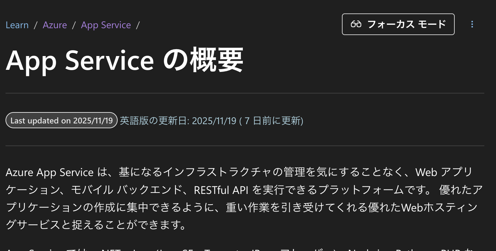
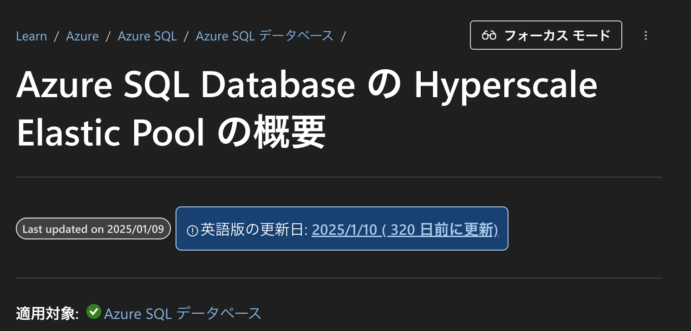

# learn\.microsoft\.com Update Checker

Displays the 'en-us' version update date of Microsoft Learn pages(`https://learn.microsoft.com/`). It compares the English version with the current language version and highlights the date if the current version is outdated.

- Microsoft Edge Addons: https://microsoftedge.microsoft.com/addons/detail/learnmicrosoftcom-updat/nnigammickcgljioobbnjlfhhkejnpce
- Chrome extension: https://chromewebstore.google.com/detail/learnmicrosoftcom-update/addjjinolilbffnlnfbaglljhngjminl

<!-- @import "[TOC]" {cmd="toc" depthFrom=1 depthTo=6 orderedList=false} -->

<!-- code_chunk_output -->

- [learn\.microsoft\.com Update Checker](#learnmicrosoftcom-update-checker)
  - [Features](#features)
  - [Installation](#installation)
    - [Prerequisites](#prerequisites)
    - [Steps](#steps)
  - [Usage](#usage)
  - [Testing](#testing)
  - [Contribution](#contribution)
  - [License](#license)

<!-- /code_chunk_output -->

## Features

- If the current language page is more recent than the 'en-us' page



- Highlights the current language page's last update date if it is older than the 'en-us' page.



- Automatically fetches the latest update date from the corresponding English version (`en-us`) of the Microsoft Learn page.
- Displays the English version's update date directly below the any language version's update date.
- Simple and intuitive design; no manual activation required.

## Installation

### Prerequisites

- Google Chrome: Ensure you have the latest version of Google Chrome installed.
- Node.js and npm: Required for running tests and managing dependencies.

### Steps

1. Clone the Repository
2. Install Dependencies

Install the necessary packages for testing.

```bash
npm install
```

3. Load the Extension into Chrome

- Open Chrome and navigate to `chrome://extensions/`.
- Enable Developer mode by toggling the switch in the top right corner.
- Click on Load unpacked and select this directory.

4. Verify Installation

Navigate to any language Microsoft Learn page (e.g., https://learn.microsoft.com/ja-jp/azure/api-management/developer-portal-enable-usage-logs) and verify that the English update date is displayed below the update date.

## Usage

Once installed, the extension works automatically without any additional setup.

1. Visit any language Microsoft Learn Page

Navigate to a page such as https://learn.microsoft.com/ja-jp/some-page.

2. View the Update Dates

Below the existing update date, you will see the English version's update date with a link to the English page.

```
[アーティクル]・2024/08/24 英語版の更新日: 2024/08/24
```

Clicking on the English update date link will open the corresponding English page in a new tab.


## Testing

This extension includes both unit and end-to-end (E2E) tests.

- Run unit tests using Jest:

```bash
npm run test:unit
```

- Run E2E tests using Puppeteer:

```bash
npm run test:e2e
```

## Architecture

### DOM Structure and Element Cloning

This extension displays English version update information by cloning the existing `article-metadata-footer` element on Microsoft Learn pages.

#### HTML Structure

The Microsoft Learn page has the following structure:

```html
<div data-main-column="">
  <div>
    <!-- Page header with breadcrumbs and actions -->
    <div id="article-header">...</div>

    <!-- Article title -->
    <div class="content"><h1>Title</h1></div>

    <!-- Top metadata (existing) -->
    <div id="article-metadata">
      <div id="user-feedback">...</div>
    </div>

    <!-- Our custom cloned element (inserted here - after article-metadata) -->
    <div id="custom-header-from-article-metadata-footer">
      <hr class="hr">
      <ul class="metadata page-metadata" lang="ja-jp">
        <li>
          <span class="badge">Last updated on 2025/10/08</span>
          <p>英語版の更新日: <a href="...">2025/4/10 (224 日前に更新)</a></p>
        </li>
      </ul>
    </div>

    <hr class="hr">

    <!-- Article content -->
    <div class="content">...</div>

    <!-- Feedback section and other components -->

    <!-- Bottom metadata (clone source) -->
    <div id="article-metadata-footer">
      <hr class="hr">
      <ul class="metadata page-metadata">
        <li>
          <span class="badge">Last updated on 2025/10/08</span>
        </li>
      </ul>
    </div>
  </div>
</div>
```

#### Cloning Strategy

The extension uses the following approach:

1. **Clone Source**: `article-metadata-footer` element (bottom of the page)
   - This element contains the page's metadata structure with proper styling

2. **Clone Process**:
   ```javascript
   customContainer = articleMetadataFooter.cloneNode(true);
   customContainer.id = 'custom-header-from-article-metadata-footer';
   ```

3. **Insertion Point**: Inserted immediately after `article-metadata` (top of the page)
   ```javascript
   articleMetadata.insertAdjacentElement('afterend', customContainer);
   ```

4. **Customization**:
   - Update the `lang` attribute to match the current page language
   - Add a new `<p>` element containing the English version update information
   - Apply appropriate styling based on whether the English version is newer

#### Why This Approach?

- **Consistency**: By cloning the existing metadata footer, we inherit all the proper CSS classes and structure
- **Maintainability**: If Microsoft changes the metadata structure, our extension adapts automatically
- **Visibility**: Placing the update information near the top of the page ensures users see it immediately
- **Clone-based**: We clone from `article-metadata-footer` at the bottom but display at the top for better UX

## Contribution

Contributions are welcome! Follow these steps to contribute:

- Fork the Repository

Click the "Fork" button at the top right of the repository page to create a copy of the repository under your GitHub account.

- Create a Feature Branch

```bash
git checkout -b feature/your-feature-name
```

- Commit Your Changes

```bash
git commit -m "Add some feature"
```

- Push to the Branch

```bash
git push origin feature/your-feature-name
```

- Open a Pull Request

Navigate to the original repository on GitHub and click "Compare & pull request". Provide a clear description of your changes and submit the pull request.

## License
[MIT License](LICENSE)
